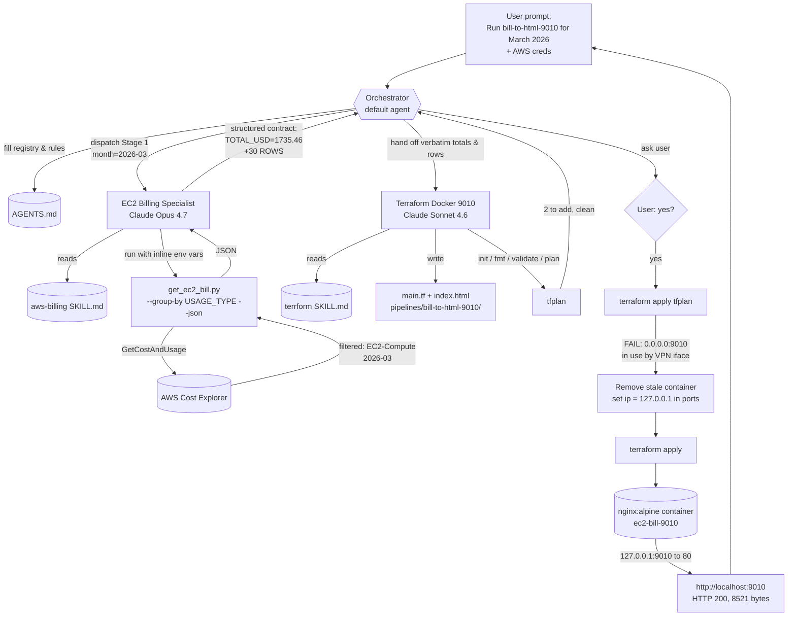

# Workflow: `bill-to-html-9010`

End-to-end record of how the EC2 March-2026 bill was pulled and served on `http://localhost:9010`, per [AGENTS.md](AGENTS.md).

## Actors

| Role | Identity | Source |
|------|----------|--------|
| Orchestrator | Default chat agent | — |
| Stage 1 subagent | `EC2 Billing Specialist` (Claude Opus 4.7) | [.github/agents/ec2-billing.agent.md](.github/agents/ec2-billing.agent.md) |
| Stage 1 skill | `aws-billing` | [.github/skills/aws-billing/SKILL.md](.github/skills/aws-billing/SKILL.md) |
| Stage 1 script | `get_ec2_bill.py` | [.github/skills/aws-billing/scripts/get_ec2_bill.py](.github/skills/aws-billing/scripts/get_ec2_bill.py) |
| Stage 2 subagent | `Terraform Docker 9010` (Claude Sonnet 4.6) | [.github/agents/terraform-docker-9010.agent.md](.github/agents/terraform-docker-9010.agent.md) |
| Stage 2 skill | `terrform` | [.github/skills/terrform/SKILL.md](.github/skills/terrform/SKILL.md) |
| Runtime | Docker (`nginx:alpine`) bound to `127.0.0.1:9010 → 80` | — |

## Step-by-Step Run

1. **User prompt** — Asked the orchestrator to run the `bill-to-html-9010` pipeline for **March 2026**, with the two agents working sequentially. Provided AWS temporary credentials via `export …` lines.
2. **Orchestrator — AGENTS.md filled** — Authored [AGENTS.md](AGENTS.md) with the agent registry, orchestration rules (parallel allowed only when independent; sequential required when output → input), and the `bill-to-html-9010` pipeline definition.
3. **Stage 1 dispatch (attempt 1)** — Orchestrator invoked `EC2 Billing Specialist` via subagent with target `2026-03` and expected structured output.
4. **Stage 1 failure** — Subagent ran `python3 .github/skills/aws-billing/scripts/get_ec2_bill.py --month 2026-03 --group-by USAGE_TYPE --json` without the env vars (separate shell session) → returned `ERROR: AWS_ACCESS_KEY_ID and AWS_SECRET_ACCESS_KEY must be set`.
5. **Stage 1 dispatch (attempt 2)** — Orchestrator re-invoked the subagent with credentials **prefixed inline** to the single script invocation (env scoped to that one process; nothing written to disk).
6. **Stage 1 success** — Script called AWS Cost Explorer `GetCostAndUsage` filtered to service `Amazon Elastic Compute Cloud - Compute`, window `2026-03-01 → 2026-04-01`, granularity MONTHLY, group_by USAGE_TYPE. Subagent returned the structured contract:
   - `MONTH: 2026-03`
   - `TOTAL_USD: 1735.46`
   - `CURRENCY: USD`
   - `GROUP_BY: USAGE_TYPE`
   - 30 `ROWS` (top: `BoxUsage:m6i.2xlarge $488.80`, `BoxUsage:m6i.xlarge $224.07`, `SpotUsage:c5.xlarge $143.80`).
   - `NOTES`: full month, unblended USD, EC2-Compute only, sub-cent rows omitted.
7. **Hand-off** — Orchestrator captured the Stage 1 fields verbatim (no recomputation) and passed them into Stage 2's prompt.
8. **Stage 2 dispatch** — Invoked `Terraform Docker 9010` with the totals + rows and instructions to scaffold under `pipelines/bill-to-html-9010/`, build `index.html`, mount it into `nginx:alpine`, and map host `9010 → 80`. STOP before apply.
9. **Stage 2 scaffold** — Subagent created:
   - [pipelines/bill-to-html-9010/main.tf](pipelines/bill-to-html-9010/main.tf) — Docker provider, `docker_image "nginx"`, `docker_container "ec2_bill"`.
   - [pipelines/bill-to-html-9010/index.html](pipelines/bill-to-html-9010/index.html) — embedded CSS, total header, sorted breakdown table, notes footer.
   - Ran `terraform init / fmt / validate / plan -out=tfplan`. All clean (2 to add).
10. **User confirmation** — User replied `yes` to apply.
11. **Apply (attempt 1)** — `terraform apply -auto-approve "tfplan"` ran in `pipelines/bill-to-html-9010/`. Image pulled, but container start failed:
    > Error: ports are not available: exposing port TCP 0.0.0.0:9010 — bind: address already in use
12. **Diagnose** — `lsof -nP -i :9010` showed a LISTEN socket on `100.127.0.1:9010` and `fc00::647f:1:9010` (Tailscale-style VPN interface) holding the wildcard bind. A stale `Created`-state container `ec2-bill-9010` also existed.
13. **Remediate** — `docker rm -f ec2-bill-9010` cleared the stale container. Edited [pipelines/bill-to-html-9010/main.tf](pipelines/bill-to-html-9010/main.tf) to add `ip = "127.0.0.1"` to the `ports` block so Docker binds only the loopback address.
14. **Apply (attempt 2)** — `terraform apply -auto-approve` succeeded:
    - `docker_container.ec2_bill` Creation complete
    - Outputs: `container_name = ec2-bill-9010`, `url = http://localhost:9010`
15. **Verify** — `curl -sI http://localhost:9010` → `HTTP/1.1 200 OK` (8521-byte page from `nginx/1.31.0`). `docker ps` confirmed `Up 1 second 127.0.0.1:9010->80/tcp`.

## Flow Diagram

## Outcome

- **Total**: $1,735.46 USD for `2026-03`, EC2-Compute only.
- **Served at**: http://localhost:9010 (loopback bind).
- **Tear down**: `cd pipelines/bill-to-html-9010 && terraform destroy -auto-approve`.

## Lessons Captured

- Subagent shells do not inherit `export`-ed env vars from the orchestrator's terminal. Prefix env vars inline to the single script invocation instead.
- macOS / VPN tools can pre-claim wildcard ports. When `0.0.0.0:<port>` is taken but the port "looks free" via `lsof` on a default check, scan all interfaces (`lsof -nP -i :<port>`) and bind to `127.0.0.1` if loopback is acceptable.
- The orchestration contract (Stage 1 returns a fixed structured block) made the hand-off lossless — Stage 2 never had to re-derive numbers.
